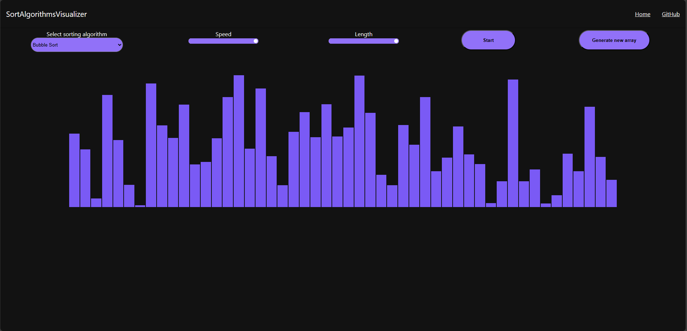
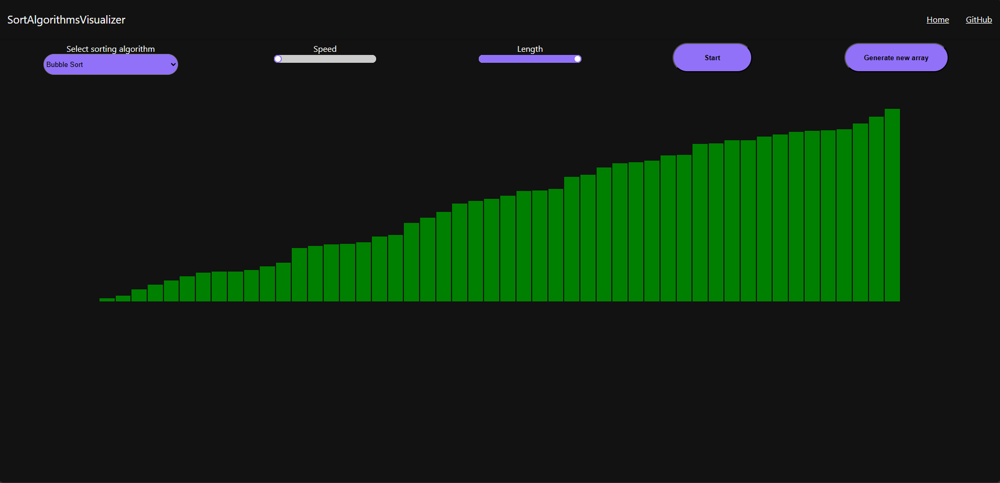

## Table of contents

- [General info](#general-info)
- [Technologies](#technologies)
- [Getting started](#getting-started)
- [License](#license)

## General info

This project is a visualizer for various sorting algorithms implemented using ReactJS. Supported algorithms include BubbleSort, InsertionSort, SelectionSort, HeapSort, and QuickSort. The application provides an interactive visualization that allows users to see how each sorting algorithm works.




## Technologies

Project is created with:

- [ReactJS](https://react.dev/)
- HTML/CSS
- NodeJS

## Getting started

To run this project, first clone this repository:

```
git clone https://github.com/pasqualeorlando/sorting-algorithm-visualizer.git
```

Then execute install and start

```
$ npm install
$ npm start
```

## License

This project is licensed under the GNU GPLv3.0 License. For more details, see the LICENSE file.
